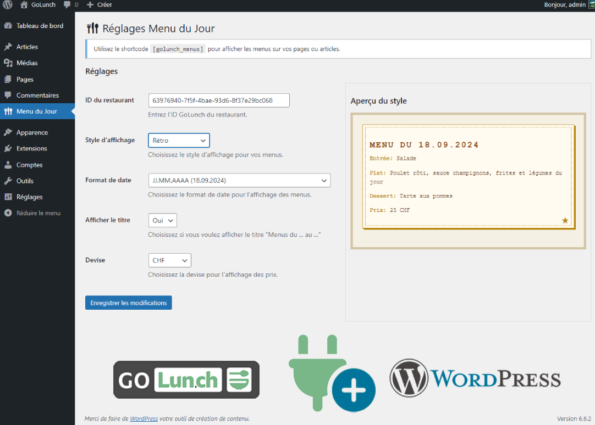

# Menu du Jour - Plugin WordPress

Ce plugin WordPress affiche les menus du jour depuis l'API GoLunch.

## Captures d'écran

Page de configuration du plugin

## Installation

1. Téléchargez le dossier du plugin et placez-le dans le répertoire `wp-content/plugins/` de votre installation WordPress.
2. Activez le plugin depuis le panneau d'administration WordPress.

## Configuration

1. Dans le panneau d'administration WordPress, cliquez sur "Menu du Jour" dans la barre latérale.
2. Entrez l'ID du restaurant par défaut.
3. Choisissez le style d'affichage pour vos menus.
4. Sélectionnez le format de date souhaité.
5. Cliquez sur "Enregistrer les modifications".

## Utilisation

Utilisez le shortcode `[golunch_menus]` dans vos pages ou articles pour afficher les menus du jour.

Pour afficher les menus d'un restaurant spécifique, utilisez l'attribut `restaurant_id` :

## Styles disponibles

Le plugin offre plusieurs styles d'affichage pour les menus :

- Par défaut
- Élégant
- Moderne
- Rustique
- Minimaliste
- Interactif
- Sombre
- Coloré
- Minimaliste Pro
- Rétro
- Futuriste
- Accordéon
- Carrousel
- Fade-in
- Vintage
- Pastel
- Néon
- Bistro
- Rustique
- Saisonnier

Vous pouvez prévisualiser ces styles dans la page de configuration du plugin.

## Personnalisation

Pour personnaliser davantage l'apparence des menus, vous pouvez modifier les fichiers CSS dans le dossier `wp-content/plugins/menudujour/styles/`.

## Support

Si vous rencontrez des problèmes ou avez des questions, veuillez ouvrir un ticket sur le dépôt GitHub du plugin.

## Licence

Ce plugin est sous licence GPL v2 ou ultérieure.
